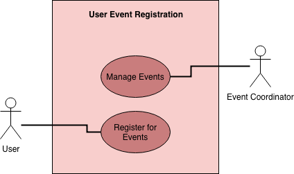
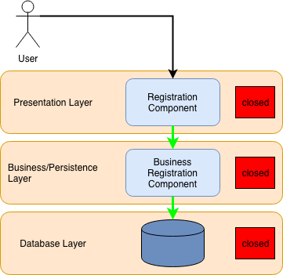

# Lab Report Template for CIS411_Lab1
Course: Messiah College CIS 411, Fall 2018  
Instructors: [Joel Worrall](https://github.com/tangollama) & [Trevor Bunch](https://github.com/trevordbunch)  
Name: James Gelok  
GitHub: [JamesGelok](https://github.com/JamesGelok)

# Step 0: Reviewing Architectural Patterns
See the [lecture / discussion](https://docs.google.com/presentation/d/1nUcy63FWPFYO3OJmERJpMjEtdaFtaIBbuUkpmNRVRas/edit#slide=id.g45345bd5ea_0_136) from CIS 411. You'll need to be familiar with the content from this lecture to complete this assignment.

Note: you are free to work with classmates on this assignment. _Good architecture is born out of collaboration - not reclusive mad-scientist behavior._ However, if you work with colleagues:

1. You must specifically note your collaborators by name at the top of your report.
2. You may not completely copy each others work (diagrams and descriptions, even if your solutions are identical).

# Step 1: MVC Architecture
Review the proposals for the Serve Central project. Let's imagine that the project has been granted (relatively) unlimited resources if they can deliver a version 1 release in 120 days. As a result, the team decides to implement an MVC architecture for its version 1 release, delivering functionality through a [responsive web application](https://en.wikipedia.org/wiki/Responsive_web_design). 

Based on the [this](https://docs.google.com/presentation/d/1UnU0xU0wF1l8pAB8trtLpdM0yuskx66jTFJzd64nsjU/edit#slide=id.g439b9c6866_2_53) and [this](https://docs.google.com/presentation/d/1-VZfAFoBVr6ijNepKAtRA7JoAQsV2Jlbf2l1WPDMhI0/edit) presentation:

1) Document two use cases of your choosing

| Use Case #1        |                                                                                                                                                            |
|--------------------|------------------------------------------------------------------------------------------------------------------------------------------------------------|
| Title              | User Event Registration                                                                                                                                    |
| Description/ Steps | As a User, I need to be able to open the app and register for an event within the app.                                                                     |
| Primary Actor      | User                                                                                                                                                       |
| Preconditions      | User must have a verified (by email) account, datastore must be available and up to date, events must be viewable within the app                           |
| Postconditions     | Send any event notifications to the user, notify event coordinator of registration, allow the event coordinator to mass communicate with user registrants. |

| Use Case #2 | |
|---|---|
| Title | Coordinator Event Drafting|
| Description / Steps | As an Event Coordinator, I must be able to draft an event in serve central so that I am completely able to create a preliminary version of the event before publishing it. |
| Primary Actor | Event Coordinator |
| Preconditions | Event Coordinator must have a verified account. Datastore must be capable of distinguishing between published and unpublished events.  |
| Postconditions | Event Coordinator is able to publish an unpublished/drafted event. For marketing purposes, Event Coordinator must be provided a link that the Event Coordinator can use to direct people to their event |

2) Highlight a [table](https://www.tablesgenerator.com/markdown_tables) of at least **four models, views, and controllers** needed to produce this project.

| Model              | View                                                   | Controller                                                   |
|--------------------|--------------------------------------------------------|--------------------------------------------------------------|
| ProfilePictureUrl  | Profile Picture                                        | Upload Image, send URL to Database                           |
| RegistrationStatus | Register Now Button                                    | OnPress, UPDATE datastore on the registration status of User |
| EventPictureUrl    | Application of image URL to respective display element | Upload Image, send URL to Database                           |
| EventTitle         | Name of Event                                          | Input Box;                                                   |

3) Generate and [embed](https://github.com/adam-p/markdown-here/wiki/Markdown-Cheatsheet#images) at least one diagram of the interaction between an Actor from the Use Cases, and one set of Model(s), View(s), and Controller(s) from the proposed architecture, including all the related / necessary services (ex: data storage and retrieval, web servers, container tech, etc.)

# Step 2: Enhancing an Architecture
After an initial release and a few months of operation, Serve Central encounters a tremendous growth opportunity to extend their service and provide a volunteer recruitment and management interface to __four__ of the primary volunteer entities in the United States. As such, a reevaluation of the architecture is required, one that allows:

1. Third-party services to both input and retrieve data from the Serve Central model/datastore. (For instance, receiving volunteer opportunities from United Way chapters across the country.)
2. Building organization-specific interfaces on top of the Serve Central business and data logic. (For instance, allowing the registration services of Serve Central to be embedded in the website of local churches, [ah-la Stripe embedding](https://stripe.com/payments/elements).)

To support these objectives:  
1. What architectural patterns (either of those presented in class on based on your own research) are appropriate? Justify your response, highlighting your presumed benefits / capabilities of your chosen architecture(s) **as well as as least one potential issue / adverse consequence** of your choice.  
2. Using your preferred diagramming tool, generate a diagram of the new Serve Central architecture that supports these two new requirements.

#1. Architectural Pattern: Layer Architecture

### Benefits: 
1. Insular architectural components allow more autonomous enhancement. *This is helpful as they scale and their teams grow larger.*
2. Allows independent technology choices per layer. *This might make externalization of organization specific interfaces easier*

### Potential Issue/s or Adverse Consequences.

1. Requires dependency mgmt. *This is a potential issue as dependency management can be a GIGANTIC pain. However, it doesn't necessarily have to be if you hire someone whose experienced and heed their warnings. ABT (always be testing)*

## 2. Diagram:

 

# Step 3: Scaling an Architecture
18 months into the future, Serve Central is experiencing profound growth in the use of the service with more than 100k daily, active users and nearly 1M event registrations per month. As a result, the [Gates Foundation](https://www.gatesfoundation.org/) has funded a project to build and launch a mobile application aimed at encouraging peer-to-peer volunteer opportunity promotion and organization. 

In addition to building a new mobile application interface, the grant requires that the project prepare for the following future needs:

1. Consuming bursts of 10k+ new volunteer opportunities per hour with a latency of less than 15 seconds between submitting an opportunity and it's availability in the registration service.
2. Supporting a volunteer and event data store that will quickly exceed 50TB of data
3. Allowing authorized parties to issue queries that traverse the TB's of data stored in your datastore(s).
4. Enabling researchers to examine patterns of volunteer opportunities as a way of determining future grant investments.

What architectural pattern(s) will you employee to support each of these needs? What will the benefits and consequences be? Why are changes needed at all? Justify your answers.

## Architectural Pattern: Blackboard

### Benefits: 
1. Blackboard can handle massive amounts of data.
2. Datastores can be independent of each other. 
3. It is easy to add new knowledge source or update existing knowledge source. 
4. All knowledge sources can work in parallel since they are very independent of each other.
5. Blackboard is well suited for supporting or refuting hypothesis, as well as applying machine learning and making new discoveries about said data.

### Potential Issue/s or Adverse Consequences.

1. Blackboard was designed for ill-defined problems. As the problem space becomes understood, the necessity of blackboard diminishes.
2. A micro-service architecture might be faster, but researchers would be at a disadvantage in coming to new insights about volunteers.

## Why are changes needed?

Changes are needed because the scale at which ServeCentral would be working at this stage would require some sort of change in architecture that could support the massive amount of bandwidth that the application would be receiving. If not blackboard, then a micro-service architecture would suffice. 

# Extra Credit
1. Create and embed a comprehensive diagram of your final architecture (i.e. one that meets all the requirements of this lab, including Step 3).
2. Augment/improve the assignment. Suggest meaningful changes in the assignment and highlight those changes in the extra credit portion of your lab report.
